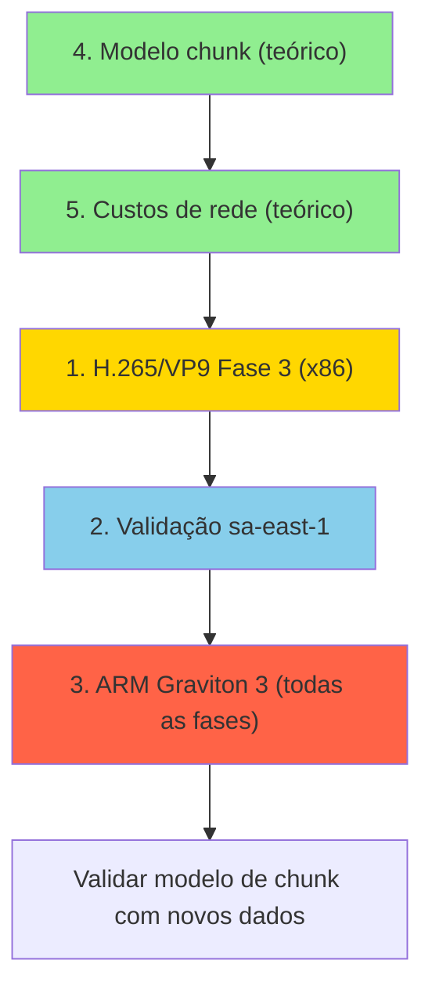

# Plano de Implementação — 5 Melhorias do EC2 Sweet Spot

> [!IMPORTANT]
> Este documento detalha **todas as 5 melhorias** propostas para o artigo. Cada seção especifica scripts a criar/adaptar, experimentos a executar, dados a coletar e seções do LaTeX a atualizar.

---

## Melhoria 1 — H.265 e VP9 na Fase 3 (Esforço Médio · ~$20–35)

### Objetivo
Estender a análise de escalonamento (Fase 3.2, AMI otimizada) para H.265 e VP9 em **todas as famílias x86 (T, M, C)**, validando se o padrão horizontal > vertical se sustenta para outros codecs.

### Scripts — Adaptação

Os scripts existentes em `artifacts2/phase3_scaling/` já têm a estrutura completa (split → parallel → Tee log). A variável `CODEC` precisa ser parametrizada.

#### [MODIFY] Scripts de Horizontal (3 scripts, 1 por família)
- [c5_large_horizontal_opt.py](file:///home/breno/doutorado/ec2sweetspot_noms2/artifacts2/phase3_scaling/c5_large_horizontal_opt.py)
- `m5_large_horizontal_opt.py` / `t3_micro_paralelo_phase2.py`
- **Mudança:** Aceitar `--codec` (libx264 / libx265 / libvpx-vp9) como argumento CLI, em vez de hardcoded `CODEC = "libx264"`

#### [MODIFY] Scripts de Vertical (3 scripts, 1 por família)
- [c5_4xlarge_vertical_opt.py](file:///home/breno/doutorado/ec2sweetspot_noms2/artifacts2/phase3_scaling/c5_4xlarge_vertical_opt.py)
- `m5_4xlarge_vertical_opt.py` / `t3_2xlarge_phase2.py`
- **Mudança:** Aceitar `--codec` como argumento CLI

#### [MODIFY] Scripts de Serial (3 scripts, 1 por família)
- `c5_large_serial_opt.py` / `m5_large_serial_opt.py` / `t3_micro_phase2.py`
- **Mudança:** Aceitar `--codec` como argumento CLI

#### [NEW] Script wrapper `run_phase3_all_codecs.py`
Orquestra 30× repetições de cada configuração (família × estratégia × codec), com logs separados por codec.

### Execuções Necessárias

| Família | Estratégia | Codec | Repetições | Total runs |
|---------|-----------|-------|-----------|------------|
| T, M, C | Serial | H.265, VP9 | 30× | 6 × 30 = 180 |
| T, M, C | Horizontal (10x) | H.265, VP9 | 30× | 6 × 30 = 180 |
| T, M, C | Vertical | H.265, VP9 | 30× | 6 × 30 = 180 |
| **Total** | | | | **540 runs** |

### Análise Estatística
- Shapiro-Wilk + Levene + Welch's t-test; Cohen's d — idêntico ao original
- Comparação horizontal vs. vertical por codec e família

### LaTeX — Seções Afetadas
- Nova tabela `tab:scaling_all_codecs` (ou expansão da `tab:scaling_all_families`)
- Novo parágrafo na seção Phase 3 Results discutindo VP9 (espera-se ganho horizontal mais pronunciado dado o thread-insensitivity da Fase 2)
- Atualização do Abstract e da Conclusion

### Hipótese
VP9 mostrou comportamento plano de thread scaling na Fase 2 → espera-se que o ganho horizontal (paralelismo por segmentos, não por threads) seja mais pronunciado para VP9 do que para H.264/H.265.

---

## Melhoria 2 — Validação em sa-east-1 (Esforço Baixo · ~$25–45)

### Objetivo
Replicar Fase 3.2 (AMI otimizada, H.264) em `sa-east-1` para todas as famílias (T, M, C), quantificando o impacto do ~50% de sobrecusto regional nos rankings.

### Pré-requisitos
1. **AMIs ARM-compatíveis em sa-east-1** — Criar novas AMIs (ou copiar as existentes via `aws ec2 copy-image`) para a região São Paulo
2. **Security Group + Key Pair** em sa-east-1
3. **Instâncias disponíveis** — Verificar quotas/limites para t3, m5, c5 em sa-east-1

#### [NEW] `create_ami_sa_east.py`
Script para copiar AMIs existentes de us-east-1 para sa-east-1 e registrar IDs.

#### [MODIFY] Scripts de Fase 3 (Serial, Horizontal, Vertical — todas as famílias)
- **Mudança:** Aceitar `--region` como argumento CLI (default `us-east-1`)
- Atualizar `ami_id` dinamicamente baseado na região

#### [NEW] `run_phase3_sa_east.py`
Wrapper que executa todas as 9 configurações (3 famílias × 3 estratégias) com 30 repetições em sa-east-1.

### Tabela de Preços sa-east-1

| Instância | us-east-1 ($/h) | sa-east-1 ($/h) | Δ% |
|-----------|-----------------|-----------------|-----|
| t3.micro | 0.0104 | ~0.0156 | +50% |
| t3.2xlarge | 0.3328 | ~0.4992 | +50% |
| m5.large | 0.0960 | ~0.1380 | +44% |
| m5.4xlarge | 0.7680 | ~1.1060 | +44% |
| c5.large | 0.0850 | ~0.1220 | +44% |
| c5.4xlarge | 0.6800 | ~0.9780 | +44% |

> Preços sa-east-1 devem ser confirmados na execução — AWS atualiza periodicamente.

### Execuções Necessárias

| Família | Estratégia | Codec | Repetições | Total runs |
|---------|-----------|-------|-----------|------------|
| T, M, C | Serial, Horizontal, Vertical | H.264 | 30× | 9 × 30 = 270 |

### LaTeX — Seções Afetadas
- Nova tabela `tab:regional_validation` comparando us-east-1 vs sa-east-1
- Novo parágrafo em Discussion / External Validity (reforçar ou qualificar a afirmação de robustez)
- Pergunta central: o `t3.micro` cluster continua dominante em custo com o overhead regional?

---

## Melhoria 3 — Família ARM / Graviton 3 (Esforço Alto · ~$50–80)

### Objetivo
Incluir instâncias Graviton 3 como quarta família completa, replicando **todas as 3 fases** para comparação direta x86 vs. ARM.

### Instâncias ARM Selecionadas

Apenas os extremos de cada sub-família (menor + maior), espelhando as instâncias-chave do estudo x86:

| ARM (Graviton 3) | Equivalente x86 | vCPUs | RAM | Custo/h (us-east-1) |
|-------------------|-----------------|-------|-----|---------------------|
| t4g.micro | t3.micro | 2 | 1 GiB | ~$0.0084 |
| t4g.2xlarge | t3.2xlarge | 8 | 32 GiB | ~$0.2688 |
| m7g.large | m5.large | 2 | 8 GiB | ~$0.0816 |
| m7g.4xlarge | m5.4xlarge | 16 | 64 GiB | ~$0.6528 |
| c7g.large | c5.large | 2 | 4 GiB | ~$0.0725 |
| c7g.4xlarge | c5.4xlarge | 16 | 32 GiB | ~$0.5798 |

> Preços devem ser confirmados antes da execução.

### Fase 1 — Homogeneidade de CPU ARM

#### [NEW] `phase1_arm_homogeneity.py`
- 100 instâncias por tipo ARM, todas as AZs de us-east-1
- Extrair `cat /proc/cpuinfo`, verificar se todas reportam Graviton 3
- Expectativa: ARM deve ser mais homogêneo (AWS controla o silício Graviton)

### Fase 2 — Benchmarks Completos ARM

#### [NEW] `all_instances_arm_phase2.py`
- Replica `all_instances_phase2_extended.py` para as 6 instâncias ARM selecionadas
- H.264, H.265, VP9; threads 1/3/5/10; 30× por configuração
- Total: 6 instâncias × 3 codecs × 4 threads × 30 = **2.160 compressões**

#### [NEW] AMI ARM customizada
- `create_custom_ami_arm.py` — Ubuntu 22.04 ARM + FFmpeg pré-instalado
- Base AMI: AMI oficial Ubuntu 22.04 ARM64 para us-east-1

### Fase 3 — Scaling ARM

#### [NEW] Scripts de Fase 3 ARM (Serial, Horizontal, Vertical) para cada sub-família (T4g, M7g, C7g)
- H.264 + H.265 + VP9 (alinhado com Melhoria 1)
- 30× por configuração
- Fases 3.1 (dinâmico) e 3.2 (AMI otimizada) completas

### LaTeX — Seções Afetadas
- Nova tabela na Fase 1: distribuição de CPU ARM (provavelmente trivial — 100% Graviton 3)
- Expansão da Tabela IV (ou tabela separada) com dados ARM
- Expansão da Tabela V (scaling) com resultados ARM
- Nova subseção em "Key Insights": x86 vs. ARM trade-offs
- Atualização do Abstract e Conclusion

### Hipótese
`t4g.micro` ~$0.0084/h vs `t3.micro` $0.0104/h (−19%). Se throughput for comparável, ARM burstable pode dominar x86 em eficiência.

---

## Melhoria 4 — Modelo Analítico de Chunk Ótimo (Esforço Baixo · $0)

### Objetivo
Derivar fórmula prescritiva para tamanho de chunk que transforma o resultado empírico ("60s é ideal") em modelo generalizável.

### Abordagem Matemática

Modelar o tempo total como:

```
T_total(c) = T_provision(N) + T_encode(c) + T_coordination(N)
```

onde:
- `c` = duração do chunk (s)
- `N = D / c` = número de nós (D = duração total do vídeo)
- `T_provision(N)` = max(provision_i) para i = 1..N (distribuição empírica do startup)
- `T_encode(c)` = taxa_encoding × c (linear, validado na Fase 2)
- `T_coordination(N)` = overhead de SFTP upload/download × N (serializado na orquestração)

### Validação
- Usar Tabela VI existente (30s / 60s / 120s) para todas as 3 famílias como ground truth
- O modelo deve reproduzir:
  - T: 60s ótimo (1.22 min), 30s pior (1.39 min), 120s pior (2.04 min)
  - M: 60s ótimo (1.22 min), 30s pior (1.63 min), 120s pior (2.10 min)
  - C: 60s ótimo (1.18 min), 30s pior (1.44 min), 120s pior (1.98 min)

### Saída Esperada
Equação ou heurística: dado `T_provision` e `rate_encode`, qual o chunk mínimo `c*` que garante speedup > 1×?

#### [NEW] Seção teórica no LaTeX
- Nova subseção em Discussion ou como extensão de "Sensitivity and Architectural Constraints"
- Equações + validação com dados empíricos
- Discussão sobre generalização para diferentes durações de vídeo e taxas de provisioning

### Validação Cruzada
Com dados da Melhoria 2 (sa-east-1) e Melhoria 3 (ARM), o modelo pode ser validado em cenários adicionais sem custo extra.

---

## Melhoria 5 — Estimativa Analítica de Custos de Rede (Esforço Baixo · $0)

### Objetivo
Modelar custos de storage e transferência para um pipeline VaaS real, quantificando o "piso de custo" que nenhuma otimização de compute elimina.

### Componentes de Custo

| Componente | Preço (us-east-1) | Preço (sa-east-1) |
|-----------|-------------------|-------------------|
| EBS gp3 (temporário) | $0.08/GB-mês | ~$0.096/GB-mês |
| Transferência intra-região (EC2↔EC2) | $0.01/GB | $0.01/GB |
| Egress (ao usuário final) | $0.09/GB (primeiro TB) | $0.15/GB |

### Cenário de Referência
- Vídeo de 10 min, 1080p
- ~500 MB input / ~150 MB output H.264 a 2 Mbps
- Pipeline: upload → split → distribui segmentos → encoding → retrieval → entrega

### Cálculo Estimado

```
Custo_rede_us_east = upload_intra(0.5GB) + N_transfers(10 × 50MB) + download_intra(150MB) + egress(150MB)
                   ≈ $0.005 + $0.005 + $0.0015 + $0.0135
                   ≈ $0.025 por vídeo
```

### Resultado Esperado
- Egress ~$0.01–0.03 por vídeo — potencialmente dominante após otimização de compute
- Compute otimizado (t3.micro cluster) = $0.00211 → rede representa ~10× o custo de compute!

#### [NEW] Seção no LaTeX
- Nova subseção "Network and Storage Cost Analysis" em Discussion
- Tabela comparando custo de compute vs. custo de rede para cada estratégia
- Insight: após otimizar compute, o egress se torna o próximo bottleneck econômico

---

## Resumo Consolidado

| # | Melhoria | Famílias | Repetições | Esforço | Custo AWS est. |
|---|----------|----------|-----------|---------|----------------|
| 1 | H.265 e VP9 na Fase 3 | T, M, C (x86) | 30× | Médio | ~$20–35 |
| 2 | Segunda região (sa-east-1) | T, M, C (x86) | 30× | Baixo | ~$25–45 |
| 3 | Família ARM (Graviton 3) | T, M, C (ARM — 6 instâncias) — todas as fases | 30× | Alto | ~$50–80 |
| 4 | Modelo analítico de chunk | — | — | Baixo | $0 |
| 5 | Estimativa de custos de rede | — | — | Baixo | $0 |
| | **Total estimado** | | | | **~$95–160** |

## Ordem de Execução Sugerida



> Melhorias 4 e 5 (teóricas) podem ser feitas **em paralelo** com a preparação dos scripts para as Melhorias 1–3, já que não dependem de dados novos.
